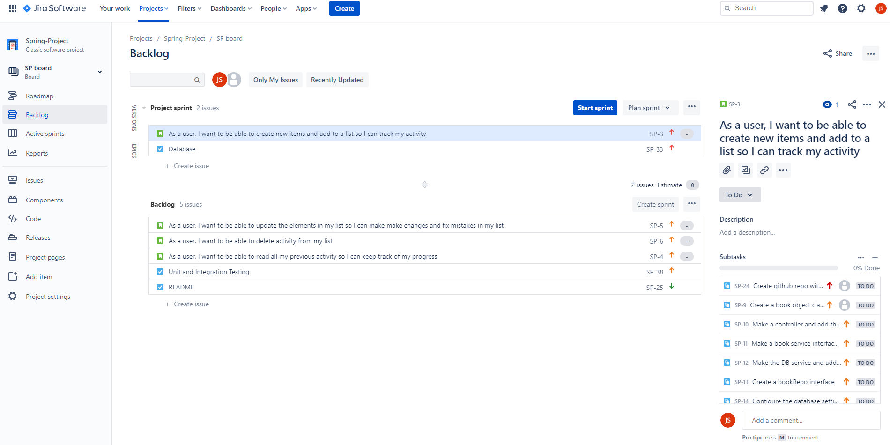
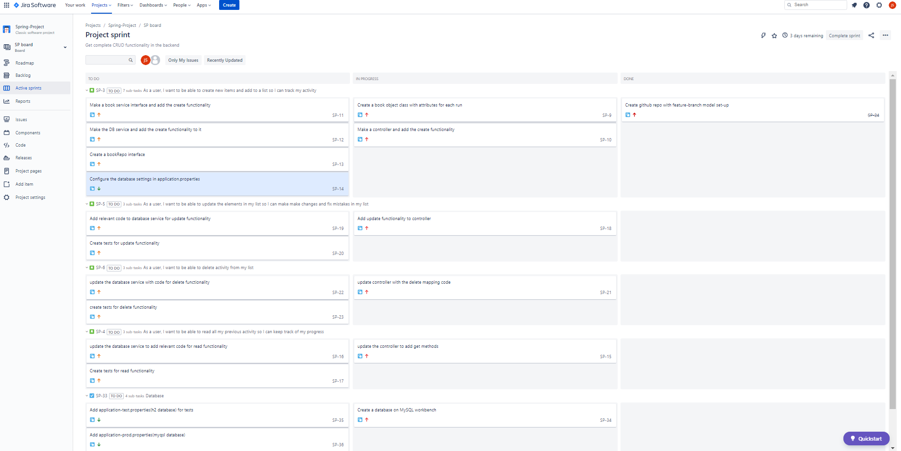
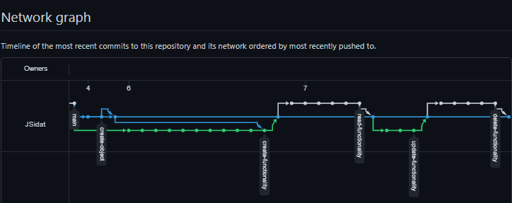
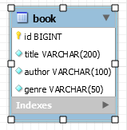
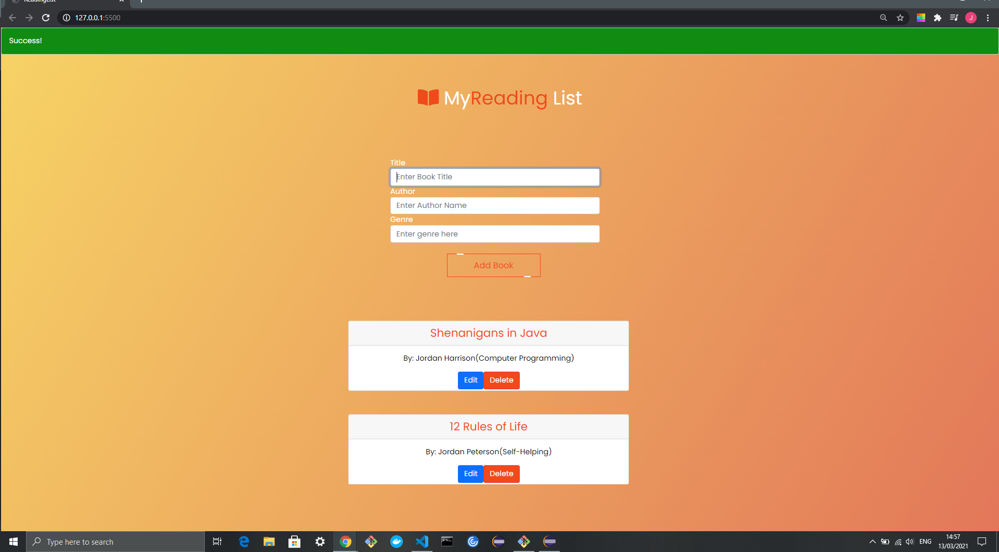
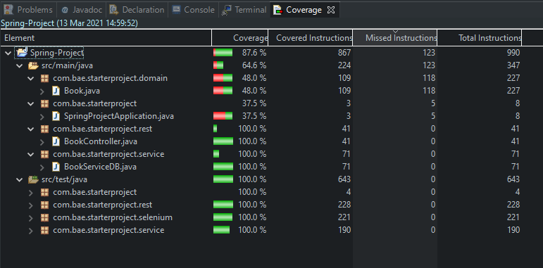
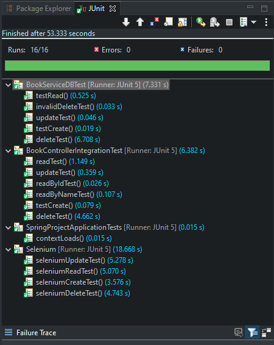

# SPRING-FRONTEND

## Table of contents

- [Introduction](#Introduction)
- [Project Scope](#Project-Scope)
- [Technology constraints](#Technology-constraints)
- [Kanban Board](#Jira-Board)
- [Version Control](#Github(Feature-Branch-Network))
- [Data Persistence](#Entity-Relationship-Diagram)
- [Testing](#Testing)
- [Areas for improvememt](#Future-Improvements)

## Introduction

The objective of this project was to create CRUD (Create, Read, Update, Delete) application by incorporating Spring (Java framework) for creating the back-end, and JavaScript, HTML and CSS for the front-end. This README will act as documentation for the project and how the different components of the project came together through project planning, code execution, and testing and evaluation.

## Project Scope

The scope of the project outlines the minimum requirements for successful completion of the deliverable which will help assess our development, against the SFIA marking framework.

- Project tracking and planning was carried out via a kanban style board, allowing for the documentation of user stories, a product backlog and progression of the project. The board for this project can be found [here](https://junaid95.atlassian.net/secure/RapidBoard.jspa?rapidView=3&projectKey=SP&selectedIssue=SP-38).

- Use of the feature-branch model for optimal version control, allowing for a safe and effective way of making changes to the source code. The link to the github repository can be found [here](https://github.com/JSidat/Spring-project) and [here](https://github.com/JSidat/SPRING-FRONTEND).

- A relational database used for the persistence of data.

- A functional application created using Java as the OOP language, following best practices and design principles.

- A front-end with an integrated API that allows users to create, read, update and delete.

- Test suite with maximum coverage and automated testing for validation of the application.

## Technology Constraints

- Kanban Board: Jira
- Version Control: Git and github
- Backend API: Java (Spring framework)
- Frontend: HTML/CSS/JavaScript
- Database: MySQL/H2 database
- Test suite: JUnit
- IDE: Eclipse (backend)/VSCode(frontend)

## Jira Board

A kanban board was used to manage workflow and keep on top of tasks that were to be completed in order to successfully complete the project. Agile methodologies were implemented where applicable as set out in the brief. For example, having a sprint backlog and defining user stories. Due to the solo nature of the project, a lot of the scrum framework could not be implemented. MoSCow prioritisation was implemented in the kanban board, where everything labelled red was deemed to be high priority as these tasks were necessary to progressing effectively through the project. As the tasks were completed they were transferred along the kanban board, giving a good visual representation of progress throughout the project.

### Initial Jira Board

### Ongoing Jira Board

### Github(Feature-Branch Network)

A feature-branch model was used to organise the commits on github for thsi project. The branches for this project were initially set up by functionality, where each component of CRUD was implemented in it's own branch before merging to the "dev" branch. Once the project was fully functional, the dev branch was pushed to main as the final commit. 

## Entity Relationship Diagram

This is the structure of the table that I used for data storage and persistence for my application.

### Back-end

The back-end was written in Java using the Spring framework. This allowed for effective communication between the back-end and the database. The database was configured in a way where for test runs, a local H2 databse was used, to prevent the main MySQL database from being populated with test dummy data. The back-end contained the logic required for storing and accessing data from the database.

### Front-end

The front-end of the application was written in JavaScript, where DOM manipulation was used to add the required elements to the webpage, with any logic that was required for CRUD functionality. JavaScript was also used to generate HTTP requests, allowing the front-end to receive data from the back-end and display it on the webpage. HTML and CSS were used to style the webpage and organise the layout of the webpage. 

A picture of the front-end can be seen below. The application allows a user to store books they wish to read by entering the name of the book, the author and the genre of the book. Details of any entry could be updated by clicking the edit button, which prompts a modal to pop up on the screen. The data entered into the modal will show up as an update on the corresponding card. Cards can also be deleted.

## Testing

A total coverage of 87.6% was achieved on the back-end of the website through a combination of unit testing and integration testing. Selenium was used for automated testing purposes, and was used to assess the functionality of the front-end on the chrome browser.

## Future Improvements

* Improve the functionality of the page. For example, have a check box to mark as "completed".
* Have a filter system, where users can filter by a certain parameter, for instance, genre or fiction/non-fiction.
* Have seperate sections for different book types by topic or genre.

### Acknowledgements

I'd like to thank the QA trainers for giving us the resources to complete the project and investing their time and knowledge into building the foundations for my tech career.

By Junaid Sidat
